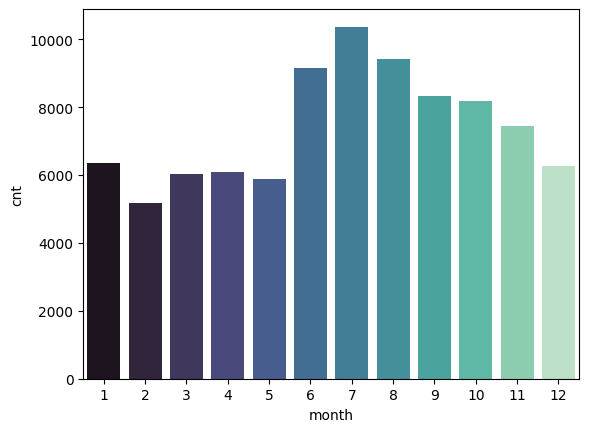
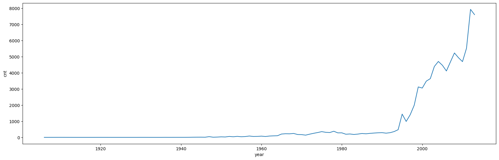

# Introduction
This is a project made for DataMania 2024, where we worked on with UFO_sightings datasets. We performed Exploratory Data Analysis and deduced some insightful correlations with sightings and distribution of army bases across US. We further peeked into the dataset to perform time series analysis.

# UFO Sighting Analytics 🌌

UFO Sightings analytics to show hotspots and frequency of UFO sightings across the globe. UFO sightings and army bases have some correlation, as cities with army bases have more UFO sightings.

## Data Cleaning 🧹

We converted all string objects to numeric data columns and datetime objects to pandas Datetime series. Most of the UFO sightings, as explained in the comments, were verified to be from other sources, so we filtered the data.

**Filtering Criteria:**
- Ambiguous descriptions by shape
- Duration
- Null values

## Data Visualization 📊

Interactive graphs using GeoPandas to add relevancy and provide a meaningful outlook. It is found that places with army bases have more UFO sightings than the rest of the US and the world.

## Test It 🧪

**Recommended:** To run on Colab or Jupyter Notebook.
Included requirements to run locally.

## Interactive Plots 🌐

Check out the interactive plots at [rahulranjansah.github.io](https://rahulranjansah.github.io)
(Needs to be updated with few other plots)

## Some Outputs of Our Plots 📈

